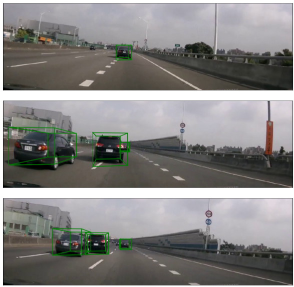

# Monocular-3D-Object-Detection

A repository of Monocular 3D object detection using RGB images

## Getting Started

These instructions will get you a copy of the project up and running on your local machine for development and testing purposes. See deployment for notes on how to deploy the project on a live system.

### Prerequisites

What things you need to install the software and how to install them

```
1. opencv
2. numpy
3. PIL
4. Keras==2.2.4
5. Tensorflow
```

### Running

To train the network

```
python3 train_1010.py
```

### Inference

To test the network

```
python3 prediction.py
```

## Result


## Authors

* **Ferdyan Dannes** - *Initial work* - [ferdyan's site](www.ferdyandannes.com)

See also the list of [contributors](https://github.com/your/project/contributors) who participated in this project.

## License

This project is licensed under the MIT License - see the [LICENSE.md](LICENSE.md) file for details

## Acknowledgments

* Hat tip to anyone whose code was used
* Inspiration
* etc

